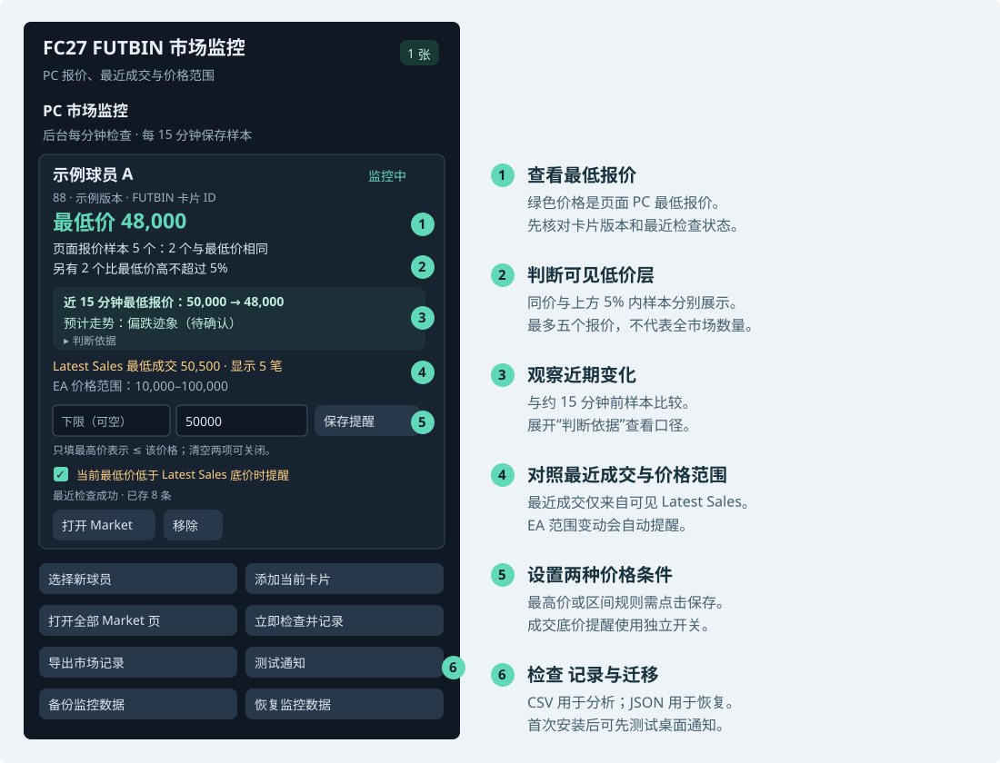
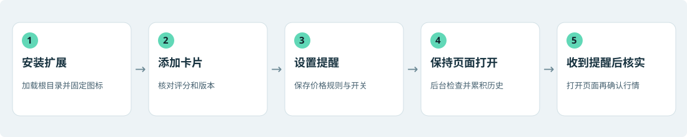

# FC27 FUTBIN 市场监控扩展

适用版本 v1.5.6 · 更新日期 2026 年 9 月 30 日

作者：MapleShadow · 允许免费转发，不可商用；转发请保留署名。

[GitHub 项目](https://github.com/maplexu1994/fc27-futbin-browser-extension) · [联系作者](mailto:maplexu1994@hotmail.com) · [使用许可](COPYRIGHT.md)

[HTML 阅读版](docs/产品文档.html) · [原 README 归档](docs/archive/README-2026-09-30.md)

这是一款面向 EA SPORTS FC27 Ultimate Team PC 市场的 Chrome / Edge 浏览器扩展。它把 FUTBIN 球员 Market 页中的最低报价、可见报价样本、最近成交和 EA 价格范围汇总到一个监控面板，按用户设置发送桌面提醒，并在本机积累市场记录。

它适合已有目标卡片、希望减少反复切页查价的玩家。使用者仍需在游戏市场中核实价格并自行完成交易；扩展提供观察与提醒，不执行买卖。

## 1 产品概览

| 项目 | 说明 |
| --- | --- |
| 产品名称 | FC27 FUTBIN Market Monitor／FC27 FUTBIN 市场监控 |
| 适用环境 | Chrome、Microsoft Edge；以解压缩扩展方式安装 |
| 监控对象 | FUTBIN FC27 卡片的 PC 市场数据；同名球员的不同版本按站内卡片 ID 区分 |
| 数据来源 | 用户正常打开的 FUTBIN 球员 Market 页面 |
| 检查频率 | 定时每分钟检查；后台监控标签刷新，当前活动标签不强制刷新 |
| 记录频率 | 每 15 分钟保存一条样本；可手动强制记录 |
| 历史容量 | 每张卡最多 672 条，按正常记录节奏约 7 天；手动频繁记录会缩短覆盖时间 |
| 数据保存 | 浏览器本机存储；CSV 用于分析，JSON 用于备份与恢复 |

## 2 它解决的痛点

| 用户遇到的问题 | 扩展如何帮助 | 用户得到的价值 |
| --- | --- | --- |
| 多张目标卡需要逐个打开、刷新和查价 | 将卡片集中到面板，定时读取对应 Market 页 | 减少重复查价和切换标签的操作 |
| 等待目标价时需要持续盯着页面 | 设置最高价或目标区间，满足条件后发送桌面通知 | 把注意力放在其他任务上，收到提醒再核实 |
| 单看最低价，难以判断低价报价是否集中 | 同时展示最低价同价数量和上方 5% 内的其他样本数量 | 看清页面可见低价层，而不只看一个数字 |
| 报价与近期成交分散，比较不方便 | 展示 Latest Sales 最低成交，并可提醒当前报价跌破该底价 | 更快发现值得进一步核实的价差 |
| 缺少前后记录，难以判断价格变化 | 保存历史样本，并显示近期最低价变化与走势提示 | 为观察价格方向和复盘提供依据 |
| EA 价格范围调整容易被忽略 | 检测范围上下限变化并通知 | 及时回看卡片的价格范围 |
| 更换安装目录或电脑后监控配置难以迁移 | JSON 备份和恢复卡片、提醒规则及历史 | 减少重新配置的工作 |

典型场景：玩家为几张目标卡设置关注价格，让对应 Market 标签在后台保持打开。桌面通知出现后，打开卡片查看报价、成交底价和最近检查时间，再到游戏市场确认是否有合适的交易机会。

## 3 核心功能

### 卡片监控与集中查看

从 FUTBIN FC27 球员详情页或 Market 页点击“添加当前卡片”，即可加入监控。扩展会把当前标签切换到 Market 页并固定标签。每张卡只需一个对应页面；评分、版本与 FUTBIN 卡片 ID 帮助识别不同卡片。

每张监控卡展示最低 PC 报价、页面报价样本分布、Latest Sales 最低成交及其时间、EA 价格范围、最近检查状态和已保存的历史条数。读取失败时，面板会标记“需处理”，旧价格标为“上次读到的”，避免误认为刚刚更新。

### 三类桌面提醒

| 提醒类型 | 设置方式 | 触发规则 |
| --- | --- | --- |
| 目标价格提醒 | 填写“提醒最高价”；可同时填写“下限”并保存 | 最低价小于等于最高价；若有下限，则必须同时大于等于下限 |
| 最近成交底价提醒 | 勾选“当前最低价低于 Latest Sales 底价时提醒” | 当前最低 PC 报价严格低于同页可见 Latest Sales 最低 PC 成交价 |
| EA 价格范围变动提醒 | 添加监控卡片后自动检测 | 后续成功读取的范围上下限相对已记录范围发生变化 |

价格提醒与成交底价提醒在条件首次满足时通知，持续满足不会每分钟重复发送；离开条件后再次满足，才会再次触发。新建或修改价格规则后，下一次成功检查若已满足条件，也可触发通知。开启成交底价提醒会立即检查该卡片；没有可解析的销售记录时不触发。

点击卡片通知可以打开对应 Market 页。“测试通知”用于确认浏览器和系统的桌面通知是否可见。

### 近期走势提示

面板将当前报价与 14 至 30 分钟前最近的一条有效历史样本比较，显示实际间隔和最低价变化。它以先前最低价为固定门槛，观察该价格及以下的可见报价数量，给出“偏涨迹象”“偏跌迹象”“初步止跌”或“方向待确认”等提示；连续两段同向变化会在文字中说明。

首次使用需等待约 15 分钟形成可比较的历史。“判断依据”可展开查看计算口径。走势提示是有限报价样本的观察结果，挂单消失也可能是撤单或到期，不代表已成交，也不保证后续价格方向。

### 历史记录与迁移

“立即检查并记录”会检查监控卡片，并为成功读取的卡片强制保存一次样本。“导出市场记录”生成 CSV，可用于表格分析，包含卡片身份、采样时间、最低价、可见报价与成交字段等。

“备份监控数据”生成 JSON，包含监控卡片、规则和市场历史。“恢复监控数据”合并历史；若同一张卡已存在，保留当前扩展中的提醒规则。恢复后需打开 Market 页，才能继续定时读取。

## 4 界面图例

图 1 依据现有界面绘制的简化示意，卡片名称与数值均为演示数据，不是实时行情截图。

示例中，五个报价是 48,000、48,000、49,000、50,000、52,000。最低价同价样本有 2 个；5% 上限为 50,400，另有 2 个报价高于最低价但不超过该上限。Latest Sales 最低成交为 50,500，当前最低价 48,000 严格低于它，开启相应开关后可满足底价提醒条件。

## 5 简要使用指南

图 2 首次使用的主要步骤。

### 第一步 安装并固定扩展

1. 在 Chrome 打开 `chrome://extensions`，或在 Edge 打开 `edge://extensions`。
2. 开启“开发人员模式”，点击“加载解压缩的扩展”。
3. 选择包含 `manifest.json` 的扩展根目录，并在浏览器工具栏固定扩展图标。

### 第二步 添加正确版本的卡片

1. 点击扩展里的“选择新球员”，在 FUTBIN 目录中打开目标卡片；也可直接打开已有的 FC27 卡片页面。
2. 确认球员、评分和卡片版本正确，等待 PC 报价和价格范围显示。
3. 点击“添加当前卡片”。页面将切换为 Market，并成为固定标签。
4. 查看面板中的身份信息和检查状态；需要立即采样时，点击“立即检查并记录”。

### 第三步 设置提醒

| 想实现的效果 | 填写或操作示例 |
| --- | --- |
| 最低价不高于 50,000 时提醒 | 下限留空，最高价填 `50000`，点击“保存提醒” |
| 最低价进入 45,000 至 50,000 时提醒 | 下限填 `45000`，最高价填 `50000`，点击“保存提醒” |
| 报价跌破可见最近成交底价时提醒 | 勾选成交底价提醒开关；它可与价格提醒同时启用 |
| 关闭目标价格提醒 | 清空上下限，点击“保存提醒” |

价格必须为正整数；设置下限时也要填写最高价，且下限不能高于最高价。只清空价格输入框不会关闭独立的成交底价提醒，需要取消其勾选。

### 第四步 保持监控并响应通知

保持浏览器运行，并保持每张卡的 Market 标签打开。扩展定时每分钟检查；活动页面不强制刷新，切到后台后才刷新。正常采样约 15 分钟后可开始查看走势提示。

点击“测试通知”确认通知可见。收到提醒后，点击通知打开对应页面，查看最近检查时间，并到游戏市场核实当前报价。浏览器休眠、系统睡眠、网络问题或页面验证都可能使检查和通知延后；每分钟是计划检查频率，不是行情更新或通知到达保证。

### 第五步 导出或备份

日常复盘使用“导出市场记录”。迁移目录或电脑前使用“备份监控数据”，在新扩展选择“恢复监控数据”，然后点击“打开全部 Market 页”。确认卡片和历史已经恢复后，再处理旧安装。

“移除”会删除该卡片的监控、状态及历史；需要保留记录时先导出或备份。同一安装目录升级时，在扩展管理页点击“重新加载”，本机已有监控和历史会保留。

## 6 数据口径与使用边界

| 指标或行为 | 正确理解 |
| --- | --- |
| 当前最低价 | FUTBIN 页面展示的 PC 最低报价，属于第三方快照，不等同于游戏市场实时价格 |
| 页面报价样本 | 最多读取页面最低的五个 PC 报价，不是全市场活动挂单总数 |
| 上方 5% 内样本 | 界面“另有”数量不含最低价同价报价；CSV 的 `within_5_percent_count` 包含同价样本 |
| Latest Sales 最低成交 | 仅取页面当前显示、可解析的 PC 销售记录，不能理解为全市场或全天最低成交 |
| 成交时间 | 可确认的时间换算为北京时间；仅有英国页面时间时按伦敦时区解释并处理夏令时；无法唯一确定时保留页面时间 |
| 历史覆盖 | 最多 672 条；检查失败不会形成有效样本，停机期间不补采，手动记录会占用条数 |
| 产品范围 | 当前版本聚焦 FC27 PC 市场；不提供自动买卖、云端同步或旧版 `cards.csv` 批次采集入口 |

## 7 隐私与权限

扩展将监控列表、提醒规则和市场历史保存在浏览器本机存储，不读取或保存 Cookie，不直接请求 FUTBIN API，也不尝试绕过网站验证。它依赖浏览器正常加载 FUTBIN 页面，并从页面读取已展示的数据。

| 权限 | 用途 |
| --- | --- |
| storage | 保存监控配置、状态及历史 |
| tabs | 查找、打开、切换、固定和刷新监控标签，整理同一卡片的重复 Market 标签 |
| alarms | 安排定时检查 |
| notifications | 发送系统桌面提醒 |
| scripting | 在需要时向匹配的 FUTBIN 页面注入读取脚本 |
| FUTBIN 网站访问权限 | 在 `https://www.futbin.com/*` 范围内配合页面读取与监控 |

备份文件会包含自己的关注卡片、提醒规则和历史记录，适合保存在个人可控的位置。本机存储不会自动跨设备共享。

## 8 常见问题

| 现象 | 处理方法 |
| --- | --- |
| 添加卡片失败 | 确认是 FUTBIN FC27 球员详情页或 Market 页，并等待 PC 报价及价格范围加载；若遇到验证，先在页面中正常完成验证 |
| 卡片显示“需处理” | 查看错误提示，点击“打开 Market”；多张卡可点击“打开全部 Market 页”，页面正常后再次检查 |
| 检查正常但没有提醒 | 核对价格规则、成交底价开关和触发条件；持续处于条件内不会反复通知；用“测试通知”检查系统通知设置 |
| 开启成交底价提醒后即时检查失败 | 开关可能已保存；确认 Market 页可读，再用“立即检查并记录”重试并查看状态 |
| 没有走势提示 | 等待约 15 分钟的有效历史；中断过久或缺少报价明细时，可能继续等待或显示方向待确认 |
| 恢复文件不被接受 | 选择“备份监控数据”生成的 JSON；CSV 不能恢复，超过 25 MB 的备份无法导入 |
| 更新后界面没有变化 | 在扩展管理页重新加载扩展；已有 FUTBIN 页面也可刷新后再试 |

文档依据当前版本的功能与界面整理，示例中的价格单位均为游戏金币。
